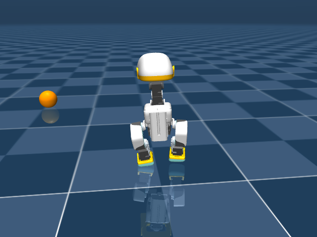
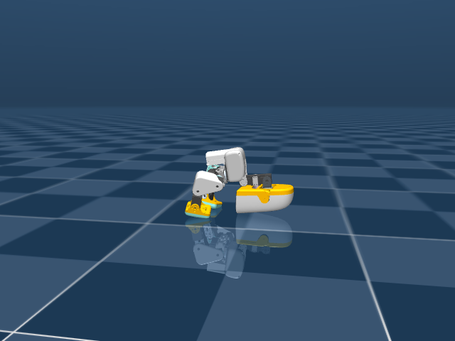
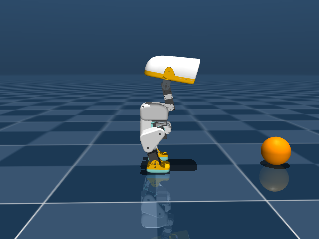

# microduck-mcp 🦆

Drive the [Pollen Robotics Microduck](https://pollen-robotics.com/microduck/)
from any [MCP](https://modelcontextprotocol.io) client — Claude Code, Claude
Desktop, or your own agent. An AI gets tools to walk the duck around, trigger
tricks, shove it, and *see* it through rendered camera frames.

Today it drives the **simulated** duck (CPU MuJoCo running the official
pretrained ONNX policies from [`pollen-robotics/microduck`](https://github.com/pollen-robotics/microduck)).
The control plane is intents-only — velocities, tricks, gaze — mirroring the
real robot's `robotd` contract, so a hardware backend can slot in behind the
same tools when your duck arrives.

| Out for a walk | Mid-roulade | Waiting for orders |
|:---:|:---:|:---:|
|  |  |  |

*All frames rendered by the `duck_camera` tool — this is literally what the AI
sees while driving.*

## Architecture

```
MCP client (Claude, ...)   duck CLI (humans / scripts)   browser: AX debug page
        │ stdio                          │                        │ http :8400
        ▼                                ▼                        ▼
   duck-mcp  ────────────►  Unix socket, JSON lines  ◄────  built-in web UI
                                    │
                                    ▼
                          duck-sim (50 Hz MuJoCo loop,
                          ONNX policy hot-swapping via
                          microduck_rl's PolicyInference)
```

Design rationale (tools vs resources, structured output, error semantics) is
documented in [docs/mcp-design-notes.md](docs/mcp-design-notes.md).

## Setup

Needs clones of the two official repos (for scenes/policy-runner and the
shipped ONNX policies), plus [uv](https://docs.astral.sh/uv/):

```bash
git clone https://github.com/pollen-robotics/microduck
git clone https://github.com/pollen-robotics/microduck_rl
git clone https://github.com/aj-dev-smith/microduck-mcp
cd microduck-mcp && uv sync
```

## Run

Start the sim server (defaults assume the three repos are siblings):

```bash
uv run duck-sim --rl-repo ../microduck_rl --policies ../microduck/policies
```

Headless by default. To watch in the MuJoCo viewer (macOS needs `mjpython`):

```bash
uv run mjpython -m microduck_mcp.sim_server --viewer \
    --rl-repo ../microduck_rl --policies ../microduck/policies
```

Poke it from a shell:

```bash
uv run duck state
uv run duck drive 0.2          # walk forward at 0.2 m/s
uv run duck trick roulade      # forward roll
uv run duck cam follow         # render a frame, prints the PNG path
uv run duck push               # shove it, watch it recover
```

Register the MCP server with Claude Code:

```bash
claude mcp add duck -- uv --directory /path/to/microduck-mcp run duck-mcp
```

## MCP tools

All state-returning tools emit typed structured output (`DuckState` schema,
units documented per field); every mutating tool returns post-action state so
the agent rarely needs a follow-up poll.

| Tool | What it does |
|---|---|
| `duck_state` | Position, orientation, body-frame velocity, active policy, upright?, plus `ball_seen` — the camera-derived ball sighting |
| `duck_drive(vx, vy, wz, duration_s?)` | Velocity intent; with `duration_s`, drives then stops and reports — one call instead of drive/poll/stop |
| `duck_stop` | Zero commands → standing policy |
| `duck_trick(name, stage_ball?)` | `sit`, `stand`, `ground_pick`, `kick_left`, `kick_right`, `roulade`. `stage_ball=False` makes kicks **honest**: no ball teleport — the agent has to walk the ball into the kick pocket first (`ball_offset_m` in state), or it kicks air |
| `duck_look(...)` | Point the head (it's a command to the policy, not a servo write) — also pans the head camera |
| `duck_sequence(steps)` | Chain drive/stop/trick/look steps server-side — motion flows through transitions with no client round-trips (arcs, an approach, kick + celebration as one call) |
| `duck_camera(view, distance)` | Rendered frame: `head` (the duck's own POV), `follow`, `front`, `side`, `top` |
| `duck_push(magnitude, angle_deg)` | Shove the trunk; tests push recovery |
| `duck_machine(action, ...)` | Load/arm/hot-reload a **behavior machine** — autonomy between the agent's decisions (see below) |
| `duck_reset` | Back to origin, default stance (`destructive_hint` — it ends the episode) |

## Honest sensing (fake mediad)

The sim exposes two views of the ball. `ball_position_m` is God-mode ground
truth. `ball_seen` is what the robot could actually know: an orange-blob
detector runs on the duck's own 320×240 head-camera render at 5 Hz and
publishes `{visible, distance_m, bearing_deg, elevation_deg, age_s}` — the
same *derived features, not frames* contract the real Microduck's `mediad`
service uses (`microduck` docs, architecture §2.4). Distance comes from the
blob's solid angle (mean error ~6% out to 1.4 m); a ball behind the duck is
honestly invisible, which makes *searching* for it a real behavior. The
detector also derives `speed_mps` by differencing its own world-frame
estimate across ticks — the robot's kinematics cancel its own motion, so a
parked ball reads ~0 even mid-stride while a kicked one reads ~1 m/s, which
is how a machine can decline to kick a rolling ball. Prefer
`ball_seen` when you want sim work to transfer to hardware.

On the pitch scene the same 5 Hz frame also feeds a **goal detector**
(`goal_seen`): the white goal frame is separated from the equally-white
pitch lines and clouds purely by ray elevation computed from the robot's own
kinematics — sky can only exist above the true horizon, painted lines on
the ground sit well below it anywhere on the pitch, and the crossbar (hung
at almost exactly camera height) lives in the narrow band between. Grazing
far-off lines that do reach the band arrive one pixel per image column;
posts stack several, and a dense-column filter drops the difference. Range
comes from the mouth's angular width. Because the goal never moves, a
sighting plus own odometry keeps `est_bearing_deg`/`est_distance_m` alive
while the head is tilted down at the ball — which is how the duck can aim a
kick at a goal it currently cannot see.

## The behavior machine

The agent doesn't have to drive every step. A **machine** — TOML source, see
[`machines/soccer.toml`](machines/soccer.toml) — binds nodes to deterministic
behaviors (`search_ball`, `approach_ball`, `kick`, `celebrate`, `drive`,
`idle`) executed at 50 Hz on the sim thread, with transitions guarded by
expressions over the **sensed digest only**: `ball_seen.*`, `upright`,
`elapsed_s`. The
guard grammar is a strict whitelist (paths, literals, comparisons,
`and/or/not` — validated at load, nothing else parses), and ground-truth ball
position is *not in the vocabulary*: an armed machine plays fair by
construction. Edit the file while it runs; `duck machine reload` hot-swaps it.
Transitions stream into the AX page's command feed tagged `machine`.

```bash
uv run duck machine load machines/soccer.toml
uv run duck machine arm     # duck finds the ball, lines up, kicks — alone
```

[`machines/striker.toml`](machines/striker.toml) is the match-play variant
for the pitch scene: `approach_ball` runs with `aim = true`, so before
attacking the ball the duck walks a detour onto the **ball→goal line of
fire** (steered by `goal_seen`'s dead-reckoned bearing, trunk offset ~35°
left of the line because that is where `kick_right` actually sends the
ball), kicks only with the remembered goal inside the kick's cone, then
stands and watches — it celebrates only when the referee calls the goal,
and chases the rebound when it doesn't. On the pitch the ball kicks off a
metre from the goal line, where the mouth subtends ±11° and aiming is the
difference between scoring and a throw-in.

The design lineage: deterministic behaviors under guarded transitions, machine
source in a git repo, hot-swapped live — a pattern borrowed from an MCP
instrument built for playing *Ocarina of Time*, ported from Hyrule to a robot.

## Filming a match

`duck film` shoots an autonomous match and cuts it to an mp4:

```bash
uv run duck film                       # -> ./duck_match.mp4
uv run duck film -o goal.mp4 --takes 3 --select goal
```

Every frame carries the four things worth showing at once: a broadcast camera
tracking duck and ball (it swings west for the celebration so the goal frame
stops blocking the shot), the **duck cam** picture-in-picture — the same 70°
head-camera view the detectors run on — a **sensed-state HUD** reading
`ball_seen.*` and `goal_seen.est_*` straight out of the machine digest, and a
**control-surface feed** of the real events: the MCP calls that armed the
machine, each transition, and the **guard expression that fired it**. What the
duck knows and why it just did that, on screen, frame by frame.

It runs cold-start takes from known-good spawns and keeps the first that
scored *and* landed the celebration (`--select goal` accepts any goal); takes
that never score are discarded, and the goal moment cold-opens the cut so it
becomes the timeline thumbnail. `--keep-takes` keeps the rushes,
`--cap-seconds` bounds a take, `--machine` films a machine other than
`striker.toml`.

Two things to know. **ffmpeg** must be on `PATH` (`brew install ffmpeg`, or
`--ffmpeg /path/to/it`) — frames are piped into it raw, and it is deliberately
not a Python dependency; the check runs before the model loads, so a missing
encoder costs a second rather than a shoot. And unlike every other
subcommand, `film` does **not** talk to a running `duck-sim`: filming wants raw
frame buffers, per-take resets and chosen spawns, none of which are socket
intents, so it boots its own headless sim (`--rl-repo`/`--policies`, same
defaults as `duck-sim`) and leaves any sim you have running alone.

## AX debug page

`duck-sim` also serves an **Agent Experience debug page** at
`http://127.0.0.1:8400` (`--web PORT`, `--web 0` to disable): a live feed of
every command hitting the control socket — tagged by client (`mcp`, `cli`,
`web`) — next to an auto-refreshing camera view and a state dashboard. Open it
beside the MuJoCo viewer to watch *what the agent is doing and what it can
see*, in real time. Plain stdlib HTTP + one HTML file; all rendering still
happens on the sim thread via the same intent queue as every other client.

## Notes

- The sim enables the ball's rolling friction at model load (the shipped spec
  declares it but leaves the geom at `condim=3`, where it never applies — a
  kicked ball glided 27 m and never stopped). With it, a kick runs ~1-2 m and
  stops; an accidental toe-poke dies in centimeters, which is what makes
  dribbling and retrying possible at all.
- The sim server executes all MuJoCo calls on one thread; socket clients only
  enqueue intents. Multiple clients are fine (MCP + CLI simultaneously).
- Policies hot-swap behind the shared 61-dim observation contract exactly as
  on the robot: driving engages walking, zero command returns to standing,
  episodic tricks time out back to standing.
- Camera rendering is offscreen (no window needed); in `--viewer` mode on
  macOS, offscreen rendering may be unavailable — run headless if you need
  frames.
- The shipped policy set includes no StandUp policy, so a duck that ends up
  [on its side](docs/images/recovery_attempt_front.png) (e.g. after a rough
  roulade landing) stays there — `duck_reset` is the escape hatch. Training
  one (`Mjlab-StandUp-*` in microduck_rl) is the fix.

## Roadmap

- [ ] Real-robot backend speaking the daemon's WebSocket API (see
      `microduck` docs `design/architecture.md` §5.3) behind the same tools
- [ ] Body-pose intents (crouch/lean while standing)
- [ ] Optional StandUp policy slot so falls are recoverable without `duck_reset`

## License

Apache-2.0. Built on [microduck](https://github.com/pollen-robotics/microduck)
and [microduck_rl](https://github.com/pollen-robotics/microduck_rl) by Pollen
Robotics, both Apache-2.0.
