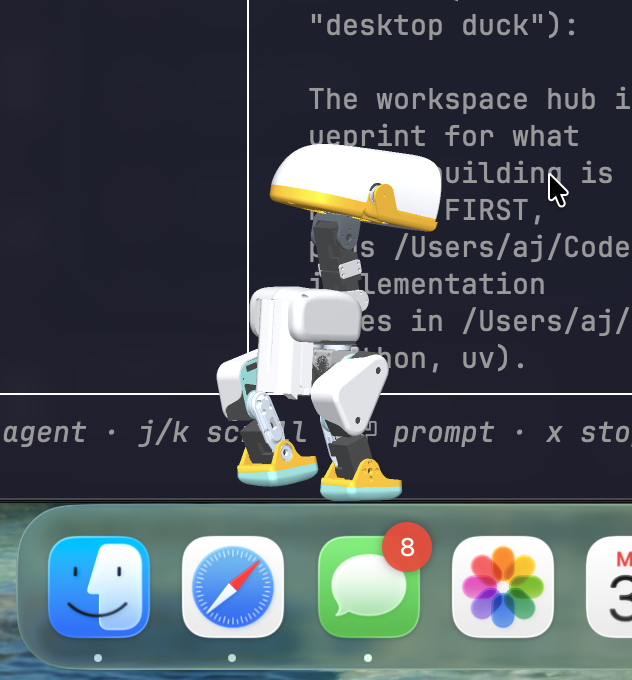

# microduck-mcp 🦆

Drive the [Pollen Robotics Microduck](https://pollen-robotics.com/microduck/)
from any [MCP](https://modelcontextprotocol.io) client — Claude Code, Claude
Desktop, or your own agent. An AI gets tools to walk the duck around, trigger
tricks, shove it, and *see* it through rendered camera frames.

Today it drives the **simulated** duck (CPU MuJoCo running the official
pretrained ONNX policies from [`pollen-robotics/microduck`](https://github.com/pollen-robotics/microduck)).
The control plane is intents-only — velocities, tricks, gaze — mirroring the
real robot's `robotd` contract, so a hardware backend can slot in behind the
same tools when your duck arrives.

| Out for a walk | Mid-roulade | Waiting for orders |
|:---:|:---:|:---:|
|  |  |  |

*All frames rendered by the `duck_camera` tool — this is literally what the AI
sees while driving.*

## Architecture

```
MCP client (Claude, ...)   duck CLI (humans / scripts)   browser: AX debug page
        │ stdio                          │                        │ http :8400
        ▼                                ▼                        ▼
   duck-mcp  ────────────►  Unix socket, JSON lines  ◄────  built-in web UI
                                    │
                                    ▼
                          duck-sim (50 Hz MuJoCo loop,
                          ONNX policy hot-swapping via
                          microduck_rl's PolicyInference)
```

Design rationale (tools vs resources, structured output, error semantics) is
documented in [docs/mcp-design-notes.md](docs/mcp-design-notes.md).

## Setup

Needs clones of the two official repos (for scenes/policy-runner and the
shipped ONNX policies), plus [uv](https://docs.astral.sh/uv/):

```bash
git clone https://github.com/pollen-robotics/microduck
git clone https://github.com/pollen-robotics/microduck_rl
git clone https://github.com/aj-dev-smith/microduck-mcp
cd microduck-mcp && uv sync
```

## Run

Start the sim server (defaults assume the three repos are siblings):

```bash
uv run duck-sim --rl-repo ../microduck_rl --policies ../microduck/policies
```

Headless by default. To watch in the MuJoCo viewer (macOS needs `mjpython`):

```bash
uv run mjpython -m microduck_mcp.sim_server --viewer \
    --rl-repo ../microduck_rl --policies ../microduck/policies
```

Poke it from a shell:

```bash
uv run duck state
uv run duck drive 0.2          # walk forward at 0.2 m/s
uv run duck trick roulade      # forward roll
uv run duck cam follow         # render a frame, prints the PNG path
uv run duck push               # shove it, watch it recover
uv run duck say "hello!"       # speak: audio host-side, beak in the sim
uv run duck chirp inquire      # nonverbal: one call from its own voice bank
uv run duck emote head_tilt    # an authored gesture, played in the sim
```

Register the MCP server with Claude Code:

```bash
claude mcp add duck -- uv --directory /path/to/microduck-mcp run duck-mcp
```

## MCP tools

All state-returning tools emit typed structured output (`DuckState` schema,
units documented per field); every mutating tool returns post-action state so
the agent rarely needs a follow-up poll.

| Tool | What it does |
|---|---|
| `duck_state` | Position, orientation, body-frame velocity, active policy, upright?, plus `ball_seen` — the camera-derived ball sighting |
| `duck_drive(vx, vy, wz, duration_s?)` | Velocity intent; with `duration_s`, drives then stops and reports — one call instead of drive/poll/stop |
| `duck_stop` | Zero commands → standing policy |
| `duck_trick(name, stage_ball?)` | `sit`, `stand`, `ground_pick`, `kick_left`, `kick_right`, `roulade`. `stage_ball=False` makes kicks **honest**: no ball teleport — the agent has to walk the ball into the kick pocket first (`ball_offset_m` in state), or it kicks air |
| `duck_look(...)` | Point the head (it's a command to the policy, not a servo write) — also pans the head camera |
| `duck_sequence(steps)` | Chain drive/stop/trick/look steps server-side — motion flows through transitions with no client round-trips (arcs, an approach, kick + celebration as one call) |
| `duck_camera(view, distance)` | Rendered frame: `head` (the duck's own POV), `follow`, `front`, `side`, `top` |
| `duck_push(magnitude, angle_deg)` | Shove the trunk; tests push recovery |
| `duck_machine(action, ...)` | Load/arm/hot-reload a **behavior machine** — autonomy between the agent's decisions (see below) |
| `duck_mouth(opening)` | Beak opening 0..1 — the real robot's `robot.mouth` verb, in the sim (expressive only, no physics) |
| `duck_say(text, voice_bank?)` | **Speak as the duck**: renders the duck's voice, plays it on the host's speakers, lip-syncs the beak live in the sim (see below) |
| `duck_chirp(tag, variant?, voice_bank?)` | One call from the duck's own voice bank — `alarm`, `greet`, `inquire`, `peck`, `chirp`, `coo`, and `wheee`, which the sim grants only when the referee has a goal on the board |
| `duck_emote(name, action?)` | Play an authored **gesture** — `head_tilt`, `nod`, `perk_up`, `droop` — or `action='list'` what a server has |
| `duck_train_tasks(refresh?)` | Task ids the GPU box can train — the live `list-envs` registry, cached |
| `duck_train_start(task_id, ...)` | **Train a new behavior**: launches a run in its own tmux session on the GPU box (see below). `smoke=True` is the 64-env / 5-iteration validation run |
| `duck_train_status(session?, tail?)` | List training sessions; for one, the wandb URL, latest iteration/reward/ETA, whether it's alive, and a diagnosis if it died |
| `duck_train_stop(session)` | Ctrl-C the trainer, then kill the session (`destructive_hint` — it ends an experiment) |
| `duck_policy(action, role?, path?)` | **The brains, inspectable and mutable on a live sim**: `list` every role's ONNX and obs width; `swap` rebinds one role to a freshly exported checkpoint with no restart. Validated off to the side first (missing/malformed file, obs-width mismatch → refused with the incumbent still flying); the reply's `previous` is the one-call rollback |
| `duck_reset` | Back to origin, default stance (`destructive_hint` — it ends the episode) |

## Honest sensing (fake mediad)

The sim exposes two views of the ball. `ball_position_m` is God-mode ground
truth. `ball_seen` is what the robot could actually know: an orange-blob
detector runs on the duck's own 320×240 head-camera render at 5 Hz and
publishes `{visible, distance_m, bearing_deg, elevation_deg, age_s}` — the
same *derived features, not frames* contract the real Microduck's `mediad`
service uses (`microduck` docs, architecture §2.4). Distance comes from the
blob's solid angle (mean error ~6% out to 1.4 m); a ball behind the duck is
honestly invisible, which makes *searching* for it a real behavior. The
detector also derives `speed_mps` by differencing its own world-frame
estimate across ticks — the robot's kinematics cancel its own motion, so a
parked ball reads ~0 even mid-stride while a kicked one reads ~1 m/s, which
is how a machine can decline to kick a rolling ball. Prefer
`ball_seen` when you want sim work to transfer to hardware.

On the pitch scene the same 5 Hz frame also feeds a **goal detector**
(`goal_seen`): the white goal frame is separated from the equally-white
pitch lines and clouds purely by ray elevation computed from the robot's own
kinematics — sky can only exist above the true horizon, painted lines on
the ground sit well below it anywhere on the pitch, and the crossbar (hung
at almost exactly camera height) lives in the narrow band between. Grazing
far-off lines that do reach the band arrive one pixel per image column;
posts stack several, and a dense-column filter drops the difference. Range
comes from the mouth's angular width. Because the goal never moves, a
sighting plus own odometry keeps `est_bearing_deg`/`est_distance_m` alive
while the head is tilted down at the ball — which is how the duck can aim a
kick at a goal it currently cannot see.

## The behavior machine

The agent doesn't have to drive every step. A **machine** — TOML source, see
[`machines/soccer.toml`](machines/soccer.toml) — binds nodes to deterministic
behaviors (`search_ball`, `approach_ball`, `kick`, `celebrate`, `drive`,
`idle`) executed at 50 Hz on the sim thread, with transitions guarded by
expressions over the **sensed digest only**: `ball_seen.*`, `upright`,
`elapsed_s`. The
guard grammar is a strict whitelist (paths, literals, comparisons,
`and/or/not` — validated at load, nothing else parses), and ground-truth ball
position is *not in the vocabulary*: an armed machine plays fair by
construction. Edit the file while it runs; `duck machine reload` hot-swaps it.
Transitions stream into the AX page's command feed tagged `machine`.

```bash
uv run duck machine load machines/soccer.toml
uv run duck machine arm     # duck finds the ball, lines up, kicks — alone
```

[`machines/striker.toml`](machines/striker.toml) is the match-play variant
for the pitch scene: `approach_ball` runs with `aim = true`, so before
attacking the ball the duck walks a detour onto the **ball→goal line of
fire** (steered by `goal_seen`'s dead-reckoned bearing, trunk offset ~35°
left of the line because that is where `kick_right` actually sends the
ball), kicks only with the remembered goal inside the kick's cone, then
stands and watches — it celebrates only when the referee calls the goal,
and chases the rebound when it doesn't. On the pitch the ball kicks off a
metre from the goal line, where the mouth subtends ±11° and aiming is the
difference between scoring and a throw-in.

### Wake nodes: the machine wakes the agent

The interrupt line runs the other way too. A node declaring `wake = "reason"`
parks a **wake pack** on entry — reason, a snapshot of the sensed digest, the
recent event tail — and a blocked `duck machine wait` (or `duck machine arm
--block-s 300`, arm-and-listen in one call) returns it. The agent's loop
becomes: block → wake into context → act (`force` a node, `reload` edited
source, speak) → block again.

A robot can't freeze like a paused game while the mind thinks, so the wake
node's own behavior is the holding pattern, and every wake node must declare
its no-answer default in source: either a transition guarded on `elapsed_s`
(the deadline — the machine answers itself and the late listener finds that
answer in the pack's `resolved` field) or an explicit
`wake_hold = "why parking here forever is safe"`. Autonomous-first,
mind-optional, by construction. [`machines/resident.toml`](machines/resident.toml)
is the idle-life machine built around this; `striker.toml` wakes on `won`
(come celebrate) and `down` (no stand-up policy — bring `duck_reset`).

### Speaking nodes: the machine says what it is doing

A node may also declare `say = "..."`. Entering it forwards the line through
the sim's `say` annotation verb — the same one `duck say` uses — so a line the
machine decided to say and one a person asked for are indistinguishable on the
event feed, and the server speaks it host-side if this session has a voice
(`duck-sim --no-voice` to keep it quiet, `--voice-bank` for the chirps). It is
an annotation in the same sense `wake` is: the guards, the behaviors and the
physics play out identically without it, and a server too old to know the key
simply ignores it. `striker.toml` speaks on `celebrate` and `won` — both
reachable only through the referee's call, so the celebration line is earned
by construction. A speaking node may add `say_mood = "excited"` — a separate
key rather than a table-valued `say`, so a server too old to know it speaks
the line neutral instead of not at all (`striker.toml`'s `celebrate` is the
one line in the repo that carries one). A node may carry `emote = "..."` the
same way, and the two fire together: mouth to say, body to emote (see
[Emotes](#emotes-the-ducks-body-language)).

The design lineage: deterministic behaviors under guarded transitions, machine
source in a git repo, hot-swapped live, and blocking wake delivery — the
machine decides what deserves a mind's attention — all patterns borrowed from
an MCP instrument built for playing *Ocarina of Time*, ported from Hyrule to
a robot.

## Filming a match

`duck film` shoots an autonomous match and cuts it to an mp4:

```bash
uv run duck film                       # -> ./duck_match.mp4
uv run duck film -o goal.mp4 --takes 3 --select goal
```

Every frame carries the four things worth showing at once: a broadcast camera
tracking duck and ball (it swings west for the celebration so the goal frame
stops blocking the shot), the **duck cam** picture-in-picture — the same 70°
head-camera view the detectors run on — a **sensed-state HUD** reading
`ball_seen.*` and `goal_seen.est_*` straight out of the machine digest, and a
**control-surface feed** of the real events: the MCP calls that armed the
machine, each transition, and the **guard expression that fired it**. What the
duck knows and why it just did that, on screen, frame by frame.

It runs cold-start takes from known-good spawns and keeps the first that
scored *and* landed the celebration (`--select goal` accepts any goal); takes
that never score are discarded, and the goal moment cold-opens the cut so it
becomes the timeline thumbnail. `--keep-takes` keeps the rushes,
`--cap-seconds` bounds a take, `--machine` films a machine other than
`striker.toml`.

### The soundtrack

The film has a voice, and it is cut from the take's **own event timeline** on
the same sim clock the frames are sampled on — not scored to the picture by
ear. The duck speaks a line as the machine arms, chirps on the kick, and the
referee's goal — *only* the referee's goal — gets the `wheee`, with the
celebration line waiting behind it. That last rule is the one this film has,
so it is a test rather than a habit: no `wheee` on the arm, on a kick, on any
other node, and not a second one when the referee's latch stays lit. There is
no music bed and no choir; every sound is the duck's own voice or its own
voice bank.

The lines are rendered before the shoot, which buys the lip-sync: the same
trajectory that places the audio drives the beak on camera and the meter in
the HUD, so picture and track come from one render. `--line-arm` and
`--line-goal` rewrite the script (an empty string deletes a line),
`--voice-bank` supplies the bank — without one the shoot renders its own with
the `sounds` crate beside `--policies` — and `--no-audio` films silently.

Sound is an enhancement, never a new way for a shoot to fail: no cargo, no
crate, no TTS, a mux that errors — each is a note on stderr and a quieter
film, and the goal you just filmed still gets cut.

Two things to know. **ffmpeg** must be on `PATH` (`brew install ffmpeg`, or
`--ffmpeg /path/to/it`) — frames are piped into it raw, and it is deliberately
not a Python dependency; the check runs before the model loads, so a missing
encoder costs a second rather than a shoot. And unlike every other
subcommand, `film` does **not** talk to a running `duck-sim`: filming wants raw
frame buffers, per-take resets and chosen spawns, none of which are socket
intents, so it boots its own headless sim (`--rl-repo`/`--policies`, same
defaults as `duck-sim`) and leaves any sim you have running alone.

## The voice (`duck say`)

The duck speaks, and its beak moves while it does:

```bash
uv run mjpython -m microduck_mcp.sim_server --viewer   # watchable sim
uv run duck say "hello A J — watch the beak"
uv run duck say "now with chirps" --voice-bank bank/
```

The voice is built to be *honestly synthetic* — an AI in a duck, not a person
in a duck suit. Text goes through TTS (macOS `say` for now; the TTS stage is
a one-function boundary meant for a phoneme-timed engine later), gets pitched
~2 semitones up, and is run through the **modulation parameters of the duck's
own synthesized personality** — the vibrato and amplitude-wobble rates that
seed 42 of the real robot's voice synth uses for its calls. Then **chirp
grains are blended into the stressed syllables**: a loudness envelope finds
the syllable nuclei with the sharpest attack, and a 90 ms grain of a real
voice-bank chirp rides each one, shaped by the word's own envelope — chirps
as an accent living in the words, not punctuation between them.

The **beak lip-sync comes from the same envelope**: fast attack, slower
release (a beak snaps open and eases shut), streamed to the sim as `mouth`
intents (0 closed → 1 open, the real robot's `robot.mouth` semantics) against
the audio playback clock with absolute deadlines, so the two cannot drift.
The shipped MJCF has no mouth joint, so at load time the sim rebuilds the
model with the soft mouth plate on a mocap body — no new degrees of freedom,
the walk policy sees a byte-identical world — and hinges it from the head's
own kinematics every tick.

The chirp bank is rendered by the real robot's voice code
([pollen-robotics/microduck](https://github.com/pollen-robotics/microduck)'s
`sounds` crate):

```bash
cargo run -p sounds -- render chirp bank/chirp.wav --seed 42
```

No bank? The duck still talks, just chirpless (with a note). `--audio-only`
skips the sim, `--wav-out` keeps the render, and `duck mouth 0.6` holds an
expression by hand. Requires `say`, `ffmpeg` and `afplay` on the host —
speech is rendered and played host-side; the sim gets only the beak.

### Moods: same duck, different weather

```bash
uv run duck say "I found the ball" --mood excited --voice-bank bank/
uv run duck say "the ball went behind the goal" --mood sad
```

`--mood neutral | excited | sad | alarmed | smug` (and `mood=` on `duck_say`).
The recipe above is the duck's *identity* and it does not move; a mood only
leans on knobs the pipeline already has — pitch, tempo, the two modulation
depths, which bank tag the grains are cut from and how loud, how many
syllables carry one, and how fast the beak shuts. A sad duck is this duck,
slower and lower and cooing over `coo*.wav` grains; an alarmed one is not
higher but faster and shakier, over `alarm*.wav`. `neutral` is the absence of
overrides and renders exactly what it always did. The whole table is eight
named fields per mood in `voice.MOODS` — retuning by ear is meant to be one
line.

### The nonverbal voice (`duck chirp`)

Words are the borrowed part. The bank the chirp grains come from holds the
duck's *own* vocabulary — `alarm`, `greet`, `inquire`, `peck`, `chirp`, `coo`,
`wheee` — and `duck chirp <tag>` plays one straight, beak driven by that call's
own envelope, no TTS and no ffmpeg in the path:

```bash
uv run duck chirp inquire --voice-bank bank/
uv run duck chirp chirp --variant 1        # sorted, so a tag is the same wav
```

One tag is not the caller's to spend. `wheee` is the goal celebration, and the
server **refuses it unless the referee has a goal on the board this episode** —
no goal, no scene with a goal in it, no wheee, whoever is holding the socket.
The film has had that rule since it had sound; here it stops being the film's
discipline and becomes the duck's.

## Emotes: the duck's body language

The third channel has no sound in it at all. An **emote** is a short authored
gesture — keyframed head pose plus beak, optionally a bank call over the top —
living as TOML in [`emotes/`](emotes/), beside the machines that trigger it:

```toml
[emote]
name = "head_tilt"
sound = "inquire"

[[key]]
t = 0.0

[[key]]                  # channels: neck_pitch, head_pitch, head_yaw,
t = 0.4                  # head_roll (radians), mouth (0..1) — omit one and
head_roll = 0.30         # it carries the previous key's value
ease = "smooth"          # how to travel INTO this key: smooth | linear | hold
```

```bash
uv run duck emote --list       # what this server has, and whether it parses
uv run duck emote droop
```

Four ship: `head_tilt` (curiosity), `nod` (yes), `perk_up` (alert), `droop`
(dejected). Signs follow the rest of the codebase — **positive pitch looks
down** — and values are clamped to the policy's head limits when applied, so a
file can be wrong about taste but not about the neck. The gesture renders to
50 Hz channel arrays and is played by the sim against its own clock, writing
`head_offset` through the same gaze command `duck_look` uses (the balance
policy compensates) and the mouth plate the voice drives. Edit a file and the
next trigger plays the edit — mtime-cached, no reload verb.

**The head belongs to somebody**, which is the whole design: say beats emote
for the beak, emote beats the behavior for the head, and an *externally*
triggered gesture is refused outright while an armed machine is in
`approach_ball` or `kick` (both steer by the head camera; the kick policy fed a
bowed head does not swing at all). A gesture arriving mid-gesture is refused
rather than restarted. Every start and every refusal lands on the event feed,
so the film and the AX page get expressiveness for free.

### Emoting nodes

A node may declare `emote = "name"` alongside `say = "..."`, and both fire on
entry — the mouth says the line, the body plays the gesture. A machine's own
trigger bypasses the head-ownership refusal, because the author already made
that call in source. The grammar validates that the name is a string and
nothing more: naming a gesture the server does not have is a lint warning at
load and a note at fire time, never a rejection, so a machine stays
hot-reloadable onto a server whose `emotes/` differs.
[`machines/resident.toml`](machines/resident.toml) startles with `perk_up` on
`ball_spotted` — the duck visibly notices the ball while the wake pack goes
out to the mind.

## Desktop pet (`duck-pet`)

`duck-pet` is a macOS overlay that puts the duck on the **top edge of your
Dock**, where it walks around on its own while you work.

<p align="center">
  
</p>

**Nothing about it is animated.** The app ships no sprites, no keyframes and
no tweens: every frame is a physics step of the same MuJoCo sim, driven by the
same shipped ONNX walk policy, served through the same `sim.submit` queue as
`duck_camera`. The sim's ground plane *is* the Dock's top edge — the camera is
orthographic, so metres-per-pixel is constant at every depth and the mapping is
exact rather than exact-near-the-middle. The window tracks `base_x`, so when
the controller stumbles the window stops and the duck face-plants on the Dock.
Two invisible walls stand at the mapped screen edges; it physically cannot walk
off. Stop the daemon and the duck freezes mid-step, tinted cool — proof of life,
the same way an unplugged robot is proof of life.

```bash
uv run duck-sim --scene desktop        # headless; --viewer has no offscreen GL
uv run duck machine load machines/pet.toml && uv run duck machine arm
uv run duck-pet                        # both sides default to port 8400
```

[`machines/pet.toml`](machines/pet.toml) is the resident pattern aimed at a
strip of screen: stroll, amble, pause, glance around, turn at the walls, doze
off, and wake nodes for the two states a duck cannot talk itself out of —
`fallen` (try `duck_trick stand`) and `stuck` (a shove would help). `stuck`
escalates rather than nagging: it tries a leg away from the wall itself, then
parks in a silent `wedged` node that wakes nobody and retries every ten
minutes, because ambient software gets one chance to be interesting before it
is an interruption.

Because the overlay is a **viewer onto the ordinary daemon**, Claude
inhabitation needs no new protocol at all: point the MCP server at the same
sim, block on `duck machine wait`, and every `duck_drive` / `duck_trick` /
`duck_say` plays out on the Dock in front of you. The pet daemon must own the
*default* socket for that (a `--socket` instance is invisible to the MCP
tools). Drag the duck with the mouse and it becomes a real `duck_push` —
the controller staggers, and recovers or falls for real. Everywhere else the
window is click-through, so the Dock underneath still works.

Roughly 18 fps of picture over 50 Hz of physics at the shipped 512 px ×2
supersampled frame; the ask drops to 1 fps on display sleep, screen lock and
occlusion. `duck pet state` / `config` / `frame` / `world` inspect the same
surface from the CLI without the GUI.

## Training new behaviors

The tools above drive a duck that already knows things. These four grow it a
new one: the agent trains a policy on a GPU box, reads the run, and ends up
with the wandb path that `microduck_rl`'s `scripts/export.py` turns into the
ONNX this sim hot-swaps.

```bash
uv run duck train tasks                                   # the live registry
uv run duck train start Mjlab-StandUp-Flat-MicroDuck --smoke   # ALWAYS first
uv run duck train start Mjlab-StandUp-Flat-MicroDuck --num-envs 4096
uv run duck train status duck-train-standup-flat-microduck
uv run duck train stop   duck-train-standup-flat-microduck
```

Everything runs over `ssh` on a box named by `$DUCK_TRAIN_HOST` (default
`duck-4090-wsl`, an alias that lands directly in Linux). The scripts these
tools build travel on **stdin** to `bash -l -s` — never as a quoted ssh
argument — so no remote shell ever re-parses them; the tmux session likewise
runs a `~/logs/<session>.sh` written on the box rather than an argument to
`tmux new-session`. That is not fastidiousness: a training command is
`cd && uv run train … | tee log` nested two shells deep, and the failure mode
of getting it wrong is finding out twelve hours later.

What the tools enforce, each because of a way this has actually gone wrong:

- **One session per task**, named `duck-train-<slug>`. Starting a run for a
  task that already has one is **refused**, never replaced.
- **`--video True`, never a bare `--video`.** mjlab configures tyro with
  `FlagConversionOff`, so booleans take a value; the bare flag is a parse
  error that killed a 12-hour StandUp run at second one.
- **Per-run logs** at `~/logs/train_<slug>_<timestamp>.log`, `tee`'d live
  under `set -o pipefail` so the recorded exit code is the trainer's and not
  `tee`'s, and so a re-run never clobbers the previous run's evidence.
- **`smoke=True` is 64 envs / 5 iterations**, per `microduck_rl/AGENTS.md`:
  minutes and cents, and it catches ~95% of config errors before you spend a
  night of GPU time on them.
- **Status is read-only** and safe to point at a live run. It parses rsl_rl's
  own output — iteration, mean reward, episode length, ETA — plus the wandb
  run path, and diagnoses the known deaths (CLI parse error, full disk, CUDA
  OOM, traceback).
- **Stop is honest about what survives**: the trainer has no interrupt
  handler, so a Ctrl-C keeps the last periodic checkpoint (every 50
  iterations by default) and nothing since.

One caveat the tools report rather than hide: if the box's WSL distro does not
run `systemd` as PID 1, WSL tears the distro down seconds after the last
session ends and takes detached tmux with it. `duck_train_start` checks PID 1
and returns a `warning` when a launch that "worked" is not going to survive.

### Duck cam: watching a run live

`scripts/box/launch_viewer.sh` (run on the box; see its header) starts mjlab's
**viser** viewer in a `duck-viewer` tmux session beside training: a browser
3D scene where the duck runs the newest checkpoint of the newest run, with a
checkpoint panel that hot-loads later ones as training writes them. Tunnel it
with `ssh -f -N -L 8080:localhost:8080 duck-4090-wsl` and open
`http://localhost:8080`. Its companion `play_viser_patched.py` wraps `play`
to skip command-GUI sliders whose degenerate ranges crash viser on some tasks
(an mjlab bug; the sim itself is fine).

## AX debug page

`duck-sim` also serves an **Agent Experience debug page** at
`http://127.0.0.1:8400` (`--web PORT`, `--web 0` to disable): a live feed of
every command hitting the control socket — tagged by client (`mcp`, `cli`,
`web`) — next to an auto-refreshing camera view and a state dashboard. Open it
beside the MuJoCo viewer to watch *what the agent is doing and what it can
see*, in real time. Plain stdlib HTTP + one HTML file; all rendering still
happens on the sim thread via the same intent queue as every other client.

## Notes

- The sim enables the ball's rolling friction at model load (the shipped spec
  declares it but leaves the geom at `condim=3`, where it never applies — a
  kicked ball glided 27 m and never stopped). With it, a kick runs ~1-2 m and
  stops; an accidental toe-poke dies in centimeters, which is what makes
  dribbling and retrying possible at all.
- The sim server executes all MuJoCo calls on one thread; socket clients only
  enqueue intents. Multiple clients are fine (MCP + CLI simultaneously).
- Policies hot-swap behind the shared 61-dim observation contract exactly as
  on the robot: driving engages walking, zero command returns to standing,
  episodic tricks time out back to standing.
- Camera rendering is offscreen (no window needed); in `--viewer` mode on
  macOS, offscreen rendering may be unavailable — run headless if you need
  frames.
- Falls are recoverable without a reset when the `sitstand` slot holds a
  getup policy: `duck_trick stand` fires it from the floor, the resident
  machine's fall reflex spends two honest attempts before waking anyone, and
  `duck_policy` swaps in a better brain the moment one finishes training.
  (Pollen ships none — the first ones here were trained from scratch via
  `Mjlab-StandUp-*` and hot-swapped in live.)

## Roadmap

- [ ] Real-robot backend speaking the daemon's WebSocket API (see
      `microduck` docs `design/architecture.md` §5.3) behind the same tools
- [ ] Body-pose intents (crouch/lean while standing)
- [x] Optional StandUp policy slot so falls are recoverable without
      `duck_reset` — shipped as `duck_policy` live hot-swap + the resident
      machine's try-twice fall reflex, running a self-trained getup brain
- [ ] Close the training loop: a `duck_train_export` that takes a finished
      run's `wandb_run_path` straight to an ONNX in the sim's policy dir, so
      train → export → hot-swap needs no human hands

## License

Apache-2.0. Built on [microduck](https://github.com/pollen-robotics/microduck)
and [microduck_rl](https://github.com/pollen-robotics/microduck_rl) by Pollen
Robotics, both Apache-2.0.
